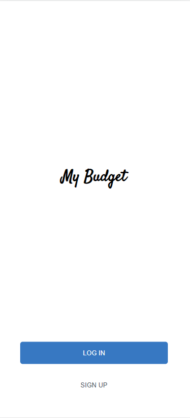
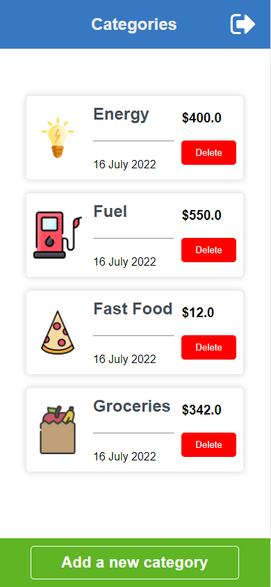
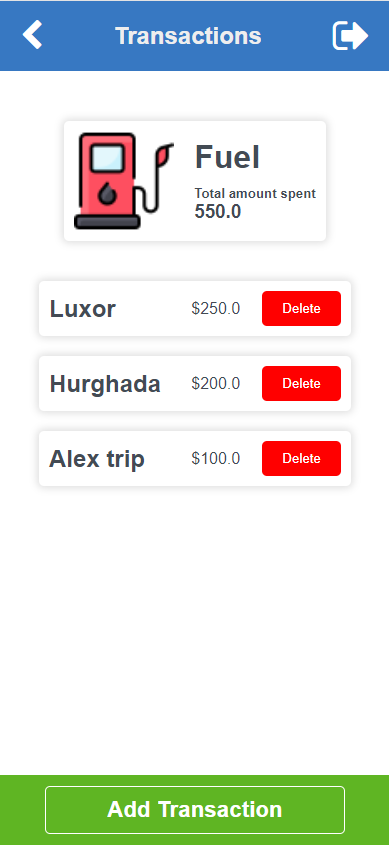

## My Budget

> This is an app build on Ruby on Rails that will help users to save their Spending's list.

## Diagram

  
  
  

## Built With

- RUBY
- Rails
- Psql
- HTML
- CSS

## Live demo

## Getting Started

Start by cloning the repository.

`https://github.com/Banstein/my-budget.git`

Navigate to the created folder.

`cd my-budget`

Start the development server

`rails server`

Test the application

`rspec spec`

## Authors

👤 Islam Bahnas

- GitHub: [@Banstein](https://github.com/Banstein)
- Twitter: [@islam_bahnas](https://twitter.com/islam_bahnas)
- LinkedIn: [islam-bahnas](www.linkedin.com/in/islam-bahnas)

## 🤝 Contributing

Contributions, issues, and feature requests are welcome!

Feel free to check the [issues page](https://github.com/Banstein/my-budget/issues).

## Show your support

Give a ⭐ if you like this project!
Special thanks to the designer

## 📝 License

This project is [MIT](./MIT.md) licensed.
